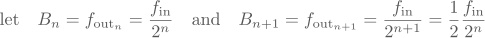
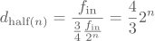
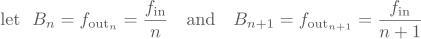

Prescaler and baudrate calculations are a tricky topic.
I have had many situations where the baudrate turned out to be off by a couple of percent, which was enough to render my serial output streams unreadable.
Sure, calculating the baudrate error beforehand would have saved me some hours of useless debugging, however, that would require understanding the often complicated mathematical formula hidden somewhere in the depths of the datasheet describing the prescaler vs. baudrate relationship.

And *that* seemed to be more work than just using a logic analyzer to measure the resulting error.
Of course, this felt like using a sledgehammer to crack a nut and it was neither a fast nor practical solution.

I think there exists a better solution and I think it can be done using pure C++.
This solution needs to be able to:

1. compute the best possible prescaler settings for the desired baudrate, and
2. notify me when the desired baudrate cannot be achieved without unresonable error.

<!--more-->

## Qualifying Baudrates

An important characteristic of clock prescalers is their finite range and resolution, which has an obvious impact on baudrate generation.

Let's look at the characteristics of the three most commonly used prescalers:

1. the power-of-two prescaler,
2. the linear prescaler, and
3. the fractional prescaler.

#### Power of Two

This type of prescaler is often used to clock peripherals which do not require a high resolution and can operate in a wide range of frequencies such as ADCs and even SPI.
It's behaviour is described by this formula:

<center markdown="block">

</center>

#### Linear

Linear prescalers are the most common type of prescaler found in microcontrollers. They typically generate clocks for timers and synchonous communication peripherals such as I<sup>2</sup>C and SPI.
Since the divisor must not be zero for obvious reasons, the input values are either mapped so that writing a zero turns the peripheral off, or the hardware adds a one to the input (mapping 0⟶1, 1⟶2, etc…).

<center markdown="block">

</center>

#### Fractional

This prescaler is used whenever a clock is required, which cannot be generated purely by integer division. The most typical application is baudrate generation for asynchronous communication such as UART.
The divisor is usually formatted as a fixed point binary fractional.
It must be understood that these prescalers cannot generate a *true* fractional output frequency, but use a [dual-modulus hardware logic](http://en.wikipedia.org/wiki/Dual-modulus_prescaler), so that the desired output frequency is met **on average**!

<center markdown="block">

</center>

#### Analysis

Here is the graphical comparison of these three prescaler functions, plotting 10 input values onto the normalized output value for all three functions. The power-of-two prescaler is light gray, the linear prescaler dark gray and is overlaid on the fractional prescaler:

<center markdown="block">

</center>

There are three very interesting observations to be made:

1. the power-of-two prescaler falls a lot faster than the others: In 10 steps it reaches <sup>1</sup>/<sub>1024</sub> instead of <sup>1</sup>/<sub>10</sub> for the linear prescaler.
2. neither the power-of-two nor the linear prescaler can generate anything between 1.0 and 0.5.
3. the distribution of generatable output frequencies is (obviously) not evenly spaced.

All prescalers are not particularly suited to generate high arbitrary output frequencies.
This also goes for the fractional prescaler, which can only switch between two fixed frequencies.

Assume you have a SPI slave that can be clocked up to 30 MHz, however your primary clock input is 40 MHz.
A fractional prescaler will clock the slave half the time with 40 MHz and the other half with 20 MHz to achieve the desired 30 MHz on average.
However, the slave might start to glitch on the 40 MHz part of the clocking, due to its electrical and timing characteristics, therefore this is not a practical solution.


## Choosing Divisors

So now that we know the formulas and properties of the most common prescalers, let's find out how we can choose the best divisor for a desired baudrate.

Between two generatable baudrates *B<sub>n</sub>* and *B<sub>n+1</sub>* lies a half-point for which there is an equal amount of baudrate error when choosing either *n* or *n+1* as a divisor.
The formula for calculating this half-point is trivial:

<center markdown="block">

</center>

So the general approach here is to find an divisor pair (*n, n+1*) so that the desired baudrate *B<sub>d</sub>* lies between *B<sub>n</sub>* and *B<sub>n+1</sub>* and then choose the divisor whose baudrate is closer to the desired one.
So if *B<sub>d</sub>* is above the half-point, we choose *n*, otherwise *n+1*.

It is important to understand that we **cannot** use this approach on the divisors directly, since there is no linear correlation between the input and output frequency.
This becomes clear in the prescaler plot above, where the half-point between 1.0 and 0.5 for the linear prescaler clearly does not lie on divisor 1.5, but somewhere around 1.3!

#### Power of Two

However, with some more math we can calculate the exact divisor *ratio* of this half-point.
We start with the power-of-two prescaler, where *B<sub>n+1</sub>* is always half of *B<sub>n</sub>*:

<center markdown="block">

</center>

By entering these into our half-point formula we get:

<center markdown="block">

</center>

However, since we wanted a divisor and not a baudrate, we divide the input frequency with the half-point baudrate:

<center markdown="block">

</center>

Choosing the divisor with the least error for any desired baudrate becomes easy now.
Here is a code example (taken from the [AVR's SPI module][nearest_p2]):

```cpp
float desired_div = input_frequency / desired_baudrate;
int nearest_div = (
	(desired_div >= ( 64 * 4.f/3)) ? 128 : (
	(desired_div >= ( 32 * 4.f/3)) ?  64 : (
	(desired_div >= ( 16 * 4.f/3)) ?  32 : (
	(desired_div >= (  8 * 4.f/3)) ?  16 : (
	(desired_div >= (  4 * 4.f/3)) ?   8 : (
	(desired_div >= (  2 * 4.f/3)) ?   4 :
									   2
	))))));
```

First the divisor of the input frequency and the desired baudrate is computed.
This divisor is then compared with all half-point divisors of our prescaler and the best value is chosen.

Notice how this algorithm will choose a divisor of 128 when the desired baudrate is too slow, and a divisor of 2 when it is too fast.
This mirrors the range limitation of the AVR's SPI prescaler!

#### Linear

Unfortunately this elegant solution is not available for the properties of the linear prescaler.
Here *B<sub>n</sub>* and *B<sub>n+1</sub>* are defined as follows:

<center markdown="block">

</center>

Using these definition in our half-point formula gets us nowhere really:

<center markdown="block">

</center>

And the half-point divisor is just insulting:

<center markdown="block">

</center>

However, a quick look at the value table of this formula does reinforce a suspicion:

| *n* | *d<sub>half(n)</sub>* | approx. |
|:---:|:---------------------:|:-------:|
|  1  | 4/3                   | 1.33333 |
|  2  | 12/5                  | 2.40000 |
|  3  | 24/7                  | 3.42857 |
|  4  | 40/9                  | 4.44444 |
|  5  | 60/11                 | 5.45455 |
|  6  | 84/13                 | 6.46154 |
|  7  | 112/15                | 7.46667 |
|  8  | 144/17                | 8.47059 |
|  9  | 180/19                | 9.47368 |

The divisors seem to approach *(n + 1/2)* for larger values, which is indeed the case and becomes clear when looking at the series expansion for *n* to infinity:

<center markdown="block">

</center>

Not that this is of any help to us, it's just nice to know ☺

#### Fractional

Just… no. It doesn't get better.

#### Generic

Okay, so even after this small binge into the underlying mathematics we still do not know how to choose a divisor for linear and fractional prescalers.

There is of course a generic solution where we just brute force this:

1. compute the desired divisor for the desired baudrate,
2. get *n* and *n+1* using *floor(desired_div)* and *ceil(desired_div)*,
3. compute the according baudrates *B<sub>n</sub>* and *B<sub>n+1</sub>*,
4. compare with the half-point baudrate and choose accordingly.

Here is a code example of this algorithm (taken from the [AVR's UART module][nearest_lin]):

```cpp
// calculate the fractional prescaler value
float desired = input_frequency / desired_baudrate;
// respect the prescaler range of 1 to 4096
int div_floor = std::floor(desired) < 1 ? 1 : std::floor(desired);
int div_ceil = std::ceil(desired) > 4096 ? 4096 : std::ceil(desired);

// calculate the baudrates above and below the requested baudrate
int baud_lower = input_frequency / div_ceil;
int baud_upper = input_frequency / div_floor;

// calculate the half-point between the upper and lower baudrate
int baud_middle = (baud_upper + baud_lower) / 2;
// decide which divisor is closer to a possible baudrate
// lower baudrate means higher divisor!
int nearest = (baudrate < baud_middle) ? div_ceil : div_floor;
// map to correct range (0 is 1, 1 is 2, etc…)
int prescaler = nearest - 1;
```

This algorithm can be adapted to work with non-continuous ranges (as in *2<sup>n</sup>* for the power-of-two prescaler) and also with fractional prescaler using binary scaling.

## Choosing Tolerances

Although these algorithms will choose the divisor with the least baudrate error, we want to have some form of control over *how much* error is still acceptable.

We are only looking at relative error which is defined as:

<center markdown="block">

</center>

A set of default tolerances should be chosen so that without any effort required from the programmer, they act as a useful guard against unreasonable baudrate errors.
So, how much error is still acceptable?

For internal peripherals like ADCs, which usually have a power-of-two prescaler and can operate in a wide range of frequencies, we chose a ±10% default tolerance.

For synchronous protocols such as SPI and I<sup>2</sup>C, the master clocks the bus and the exact baudrate does not really matter.
Of course, when operating the aforementioned SPI slave at 30 MHz you want to be reasonably certain that you aren't clocking it at 35 MHz, which causes it to glitch.
So for xpcc we chose a ±5% default tolerance.

However, asynchronous protocols simply do not allow for much tolerance.
The relative baudrate error tolerance for UART with 8N1 configuration (8 databits, 1 startbit and 1 stopbit) as shown below is only ±5%. The sample point of the stop bit may only shift by at most ±*t<sub>Symbol</sub> /2* and with 10 bits to read, one *t<sub>Symbol</sub>* equals one tenth of the symbol transmission time, hence a relative tolerance of ±5%. For example, the tolerance for 7-bit transfers (9 baudtimes) increases to ±5.56%.

<center markdown="block">
{: width="500"}
</center>

However, since both transmitter and receiver may not generate the exact baudrate, the error must not exceed **±5% in total**, which in the worst case (one too fast, one too slow) imposes a tight allowed deviation of +2.5% and -2.5% on the modules respectively.
In xpcc we therefore chose ±2% default tolerance for linear prescalers and ±1% for fractional prescalers.

If a generated baudrate is found to be outside of the default tolerance, this information must be conveyed to the programmer!
Of course, (s)he must able to overwrite the default tolerances to make them more or less restrictive, depending on the application.


## At Compile Time

Now, we could slack off and just implement all this at runtime.
There are a couple of issues with this on a microcontroller:

1. It's simply inefficient: How often do you set your baudrates? Once?
2. How do you communicate to the programmer that your generated baudrate is above your declared tolerance? Serial output?
3. What is the runtime supposed to do with a test failure? Automatically switch to another baudrate?

Especially on AVRs the computational toll of using floating point and 32bit values to compute a one-time value is quite immense.
Even if you have multiple baudrates that you need to switch to at runtime, it is cheaper in both storage and execution time to use a lookup table!

However, the second and third points are the real culprit.
It would be plain stupid to even attempt to output an error string over UART that the generated (UART) baudrate is outside of the declared tolerance.
Automatically switching to another baudrate is even more stupid, as this defies the purpose of having chosen a particular baudrate.

No, this is a problem that can and must be solved at compile time.
Fortunately with C++11 is has become possible to use constexpr functions and static assertions, which make compile-time computation and communication a lot easier.

#### Implementation

Here is the full compile-time implementation of the AVR's SPI initialize method:

```cpp
/**
 * Initializes the hardware and sets the baudrate.
 *
 * @tparam	SystemClock
 * 		the currently active system clock
 * @tparam	baudrate
 * 		the desired baudrate in Hz
 * @tparam	tolerance
 * 		the allowed relative tolerance for the resulting baudrate
 */
template< class SystemClock, uint32_t baudrate,
		uint16_t tolerance = Tolerance::FivePercent >
static void
initialize()
{
	// calculate the nearest prescaler from the baudrate
	constexpr float desired = float(SystemClock::Spi) / baudrate;
	constexpr uint8_t nearest = (
			(nearest >= ( 64 * 4.f/3)) ? 128 : (
			(nearest >= ( 32 * 4.f/3)) ?  64 : (
			(nearest >= ( 16 * 4.f/3)) ?  32 : (
			(nearest >= (  8 * 4.f/3)) ?  16 : (
			(nearest >= (  4 * 4.f/3)) ?   8 : (
			(nearest >= (  2 * 4.f/3)) ?   4 :
										   2
			))))));

	// check if we found a prescaler which generates
	// a baudrate within the declared tolerance
	assertBaudrateInTolerance<
			SystemClock::Spi / nearest,	// available baudrate
			baudrate,					// desired baudrate
			tolerance >();				// allowed tolerance

	// translate the prescaler into the bitmapping
	constexpr Prescaler prescaler = (
			(nearest >= 128) ? Prescaler::Div128 : (
			(nearest >=  64) ? Prescaler::Div64  : (
			(nearest >=  32) ? Prescaler::Div32  : (
			(nearest >=  16) ? Prescaler::Div16  : (
			(nearest >=   8) ? Prescaler::Div8   : (
			(nearest >=   4) ? Prescaler::Div4   :
							   Prescaler::Div2
			))))));

	// do the actual initialization at runtime
	initialize(prescaler);
}
```

The primary algorithm has already been described before.
What's new is `SystemClock` which is a static class that contains the current clock tree configuration (also computed at compile time using similar methods).
On the AVR this contains the compile-time constant `SystemClock::Spi` with the input clock frequency of the SPI peripheral.
This unburdens the programmer to know from which clock domain the peripheral is clocked.

The `assertBaudrateInTolerance` is given *B<sub>available</sub>*, *B<sub>desired</sub>* and the allowed tolerance and raises a `static_assert` if the test fails.
The `nearest` divisor is then mapped onto the register bit representation and this is then used to initialize the prescaler and peripheral.

And all of this happens at compile-time, the runtime only knows one 8bit program-space constant and simply copies it into the prescaler register.

#### Usage

All the programmer has to write is this:

```cpp
Spi::initialize<systemClock, MHz8>(); // with ±5% tolerance
```

Should you want to change the SPI baudrate at runtime, you can do that simply by re-initializing with a different baudrate:

```cpp
// 4.4 MHz with explicit ±10% tolerance
Spi::initialize<systemClock, 4400000, xpcc::Tolerance::TenPercent>();
```

Changing prescaler values often requires the peripheral to be switched off and then restarted.
Calling the `initialize` method again guarantees correct operation.
The overhead of this is only the loading of the compile-time constant which contains the prescaler value for 4 MHz and a call to the real initialize method of the peripheral.

If you have several baudrates that you need to choose at runtime, a switch-case "lookup table" is still more efficient than a computation at runtime (while guaranteeing tolerance compliance):

```cpp
switch(baudrate)
{
	case 8000000:
		Spi::initialize<systemClock, MHz8>();
		break;
	case 4000000:
		Spi::initialize<systemClock, MHz4>();
		break;
	case 2000000:
		Spi::initialize<systemClock, MHz2>();
		break;
	case 1000000:
		Spi::initialize<systemClock, MHz1>();
		break;
	...
}
```

It is apparent that the usage is incredibly simple.

#### On Failures

Should the tolerance check fail, then the compiler will show you the baudrate it computed.
Unfortunately the output is relatively unreadable, since there are templates involved. However, it's still better than nothing, so stop complaining.

```cpp
// Here I want *exactly* 115.2kBaud! No problem.
Uart::initialize<systemClock, 115200, xpcc::Tolerance::Exact>();
```

Compiling the above example on an AVR clocked with 16MHz will lead to a static assertion failure, since the desired baudrate of 115.2kBaud cannot be generated:

```
interface.hpp: In instantiation of 'static void xpcc::Peripheral::assertBaudrateInTolerance() [with long unsigned int available = 111111ul; long unsigned int requested = 115200ul; unsigned int tolerance = 0u]':
...
interface.hpp:94:3: error: static assertion failed: The closest available baudrate exceeds the tolerance of the requested baudrate!
   static_assert(xpcc::Tolerance::isValueInTolerance(requested, available, tolerance),
```

We can see that the closest available baudrate seems to be 111.1kBaud which has a full 3.5% relative error, which would not even have been allowed with the default tolerance.

Now you can just start trying different baudrates, for example 38.4kBaud, which has almost no error with the actual baudrate being 38.461kBaud.
Piece a cake, am I right?

## Conclusions

Apart from the technical elegance of computing these values at compile-time, there is a real improvement in the programmer's experience of using prescalers:

1. You are declaring **what** you want, not **how** to get it.
2. You can now specify and enforce baudrate *quality* directly in your code.
3. There is no need to read the datasheet anymore, trial and error suffices.
4. The compiler can give you an alternative baudrate with *zero* error!
5. Your code is your documentation, since tolerance compliance is enforced.

Of course, the framework developers now have to do the grunt work of understanding how the prescaler works and implement the algorithms accordingly.
However, the reward outweighs the effort many times over, and might save you a lot of time not having to debug your prescaler calculations.

*This post was first published at blog.xpcc.io.*

[nearest_p2]: https://github.com/roboterclubaachen/xpcc/blob/develop/src/xpcc/architecture/platform/driver/spi/at90_tiny_mega/spi_master.hpp.in?ts=4#L69
[nearest_lin]: https://github.com/roboterclubaachen/xpcc/blob/develop/src/xpcc/architecture/platform/driver/uart/at90_tiny_mega/uart.hpp.in?ts=4#L66
