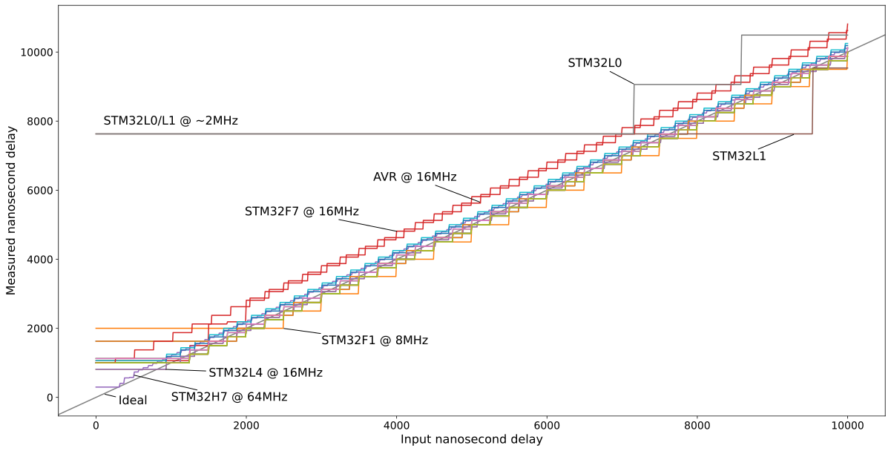
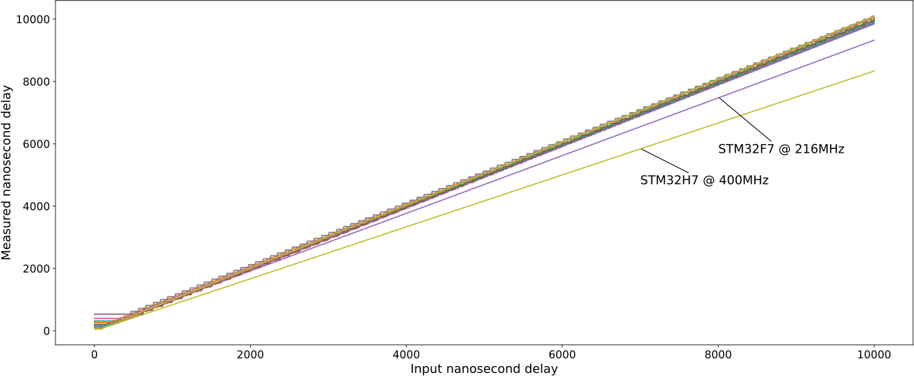
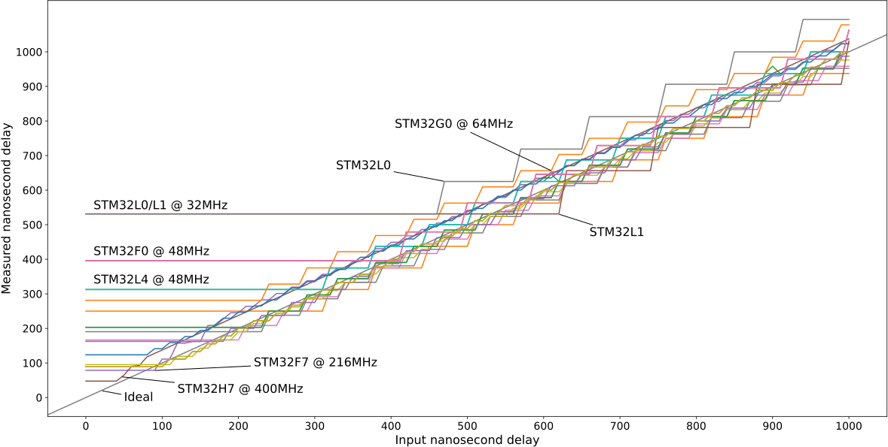

Accurately spinning for short and long time durations is an essential part of an embedded application. In the [modm embedded library](https://modm.io) we provide blocking delay functions in the resolution of milli-, micro- and even nanoseconds. Let me show you how we used the available hardware to implement a fast, efficient and flexible API that works with thousands of devices all with different clock configurations.

The most prominent uses for blocking delays in modm are during initialization of internal peripherals and external drivers that may require a few micro- to milliseconds to stabilize their hardware, and when bit-banging protocols in software with kHz and MHz baudrates requiring micro- or even nanosecond delay.

The delay functions must be as accurate as possible. In particular they must have the shortest possible overhead and a low error over at least 1s of delay. They must already work before main (during the global constructor calls) and remain accurate if the clock configuration and therefore the CPU frequency dynamically changes. They must also be reentrant so they can be called from inside an interrupt if needed. And lastly they should be compatible with the `std::chrono` time units, so that we can pass them literals for ease of use:

```cpp
modm::delay(1s);      // non-literal version
modm::delay(10ms);    modm::delay_ms(10);
modm::delay(100us);   modm::delay_us(100);
modm::delay(1000ns);  modm::delay_ns(1000);
```


# Computing Cycles

The simplest delay function converts the input time to CPU cycles and then spins in place counting them down. For the conversion we need to know the CPU frequency and have some mechanism for keeping track of elapsed CPU cycles.

For microsecond and longer delays the conversion is simple: *1µs = 1MHz<sup>-1</sup>*, so you can just take the CPU frequency in MHz and multiply it with the input to get the cycles. We store the frequency in a global `uint16_t` already scaled down to MHz and initialized with the boot frequency during startup.

```cpp
// microcontroller boots with a 8MHz clock
uint16_t fcpu_MHz = 8;
// simple conversion with multiplication
uint32_t cycles = us * fcpu_MHz;
```

This works well for frequencies that divide 1MHz cleanly, however, the STM32L0/L1 microcontrollers boot at 2.097MHz for example, which results in a 5% error right after boot. We therefore binary scale the MHz value to achieve a much lower error, which can be done very efficiently with bit shifting:

```cpp
// multiply MHz with power-of-two 2^5 = 32
constexpr uint8_t shift = 5;
// 2.097MHz * 32  ->  67 = 2.09375MHz  ->  ~0.2% error
constinit uint16_t fcpu_MHz = std::round(2.097f * (1ul << shift));
// divide with simple bit shift
uint32_t cycles = (us * fcpu_MHz) >> shift;
```

To keep the 32-bit multiplication from overflowing and to maintain at least 1s = 1'000'000µs of delay, we must limit the scaling so that *2<sup>32 - shift</sup> / max_fcpu ≥ 1s*. A scalar of 32 (shift 5) is only good up to 134MHz, while the fastest STM32H7 running at 480MHz limits the scalar to only 8 (shift 3).

For nanosecond delay we need a different algorithm, since the microcontrollers all run below 1GHz so one CPU cycle is several nanoseconds long. For example, the STM32F7 runnning at 216MHz will take ~4.6ns per cycle. To get the cycles from a nanosecond input we would need to *divide*:

```cpp
float ns_per_cycle = 4.6f;
uint32_t cycles = ns / ns_per_cycle;
```

This is obviously way too slow to compute, but we first need to understand how to accurately *count* cycles to find a better solution to this problem.


# Counting Cycles

Wouldn't it be nice if we could just delegate counting cycles to some hardware counter? Well, look no further than the [Data Watchpoint and Trace Unit (DWT)](https://developer.arm.com/documentation/ddi0439/b/Data-Watchpoint-and-Trace-Unit/DWT-functional-description?lang=en) and its 32-bit `CYCCNT` counter free running at CPU frequency!

```cpp
// Enable Tracing Debug Unit
CoreDebug->DEMCR |= CoreDebug_DEMCR_TRCENA_Msk;
// Enable CPU cycle counter
DWT->CTRL |= DWT_CTRL_CYCCNTENA_Msk;
```

By reading `DWT->CYCCNT` once at the beginning and then comparing this constantly in a loop until the number of cycles have passed, we can implement a very simple, yet very accurate delay function:

```cpp
void modm::delay_us(uint32_t us)
{
    const uint32_t start = DWT->CYCCNT;
    const uint32_t cycles = fcpu_MHz * us >> shift;
    while (true)
    {
        const uint32_t now = DWT->CYCCNT;
        if (now - start >= cycles) break;
    }
}
```

Bonus win for this solution: time spent in interrupts during the delay is compensated for, since the hardware counter continues counting throughout.


# Counting Loops

Unfortunately, the `DWT` peripheral is not accessible in all ARMv7-M devices (NRF52 only allows the debugger to access it) and it's not even implemented on ARM Cortex-M0(+) aka. ARMv6-M devices, so we have to count cycles a different way. We could use the `SysTick->VAL`, however it's just a 24-bit counter, which limits us to ~16.8 million cycles: a ~1s delay at 16MHz or a maximum 35ms delay (!) at 480MHz. In addition, the SysTick is often used for preemptive scheduling (in FreeRTOS) or to create a global clock (for software timers), so we cannot use it as a replacement.

Instead we will count cycles the old fashioned way: in a tight assembly loop with a known timing. We use two 16-bit Thumb-2 instructions: [subtraction with condition flags update](https://www.keil.com/support/man/docs/armasm/armasm_dom1361289908389.htm) and [branch back if positive](https://www.keil.com/support/man/docs/armasm/armasm_dom1361289863797.htm). They are aligned so they fit into a single 32-bit instruction fetch and fill the pipeline entirely, giving us the maximum performance: 1 cycle for the subtraction and 2-cycles to branch back, so the loop takes 3 cycles total:

```cpp
void modm::delay_us(uint32_t us) modm_fastcode
{
    const uint32_t cycles = fcpu_MHz * us >> shift;
    asm volatile (
        ".align 4"        // align for *one* 32-bit instruction fetch
    "1:  subs %0, %0, #3" // subtract the loop cycles
        "bpl  1b"         // loop while cycles are positive
    :: "l" (cycles));
}
```

The instruction fetch timings for executing directly from Flash depends on the CPU speed, the currently configured wait states and the state of the instruction cache (if available and configured) and finally the branch speculation of the cache implementation. We therefore place the entire function into SRAM using the `modm_fastcode` attribute, which gives us *predictable* timings for instruction fetches across all Cortex-M cores, since we're bypassing the Flash wait states and the (vendor supplied) cache entirely.

Predictable, but not consistent: In my experiments I've discovered the loop to take 3 cycles on STM32{F3, G0, G4, L0, L4}, 4 cycles on STM32{L1, F0, F1, F4, F2} and just 1 cycle (!) on STM32F7. The timings depend on the (vendor defined) bus matrix implementation and the system configuration and are mainly about whether the Instruction Bus (I-Code) can access SRAM directly or whether the access is performed by the slower System Bus (S-Bus). The [STM32F4 reference manual states in section 2.3.1 Embedded SRAM](https://www.st.com/resource/en/reference_manual/dm00031020-stm32f405-415-stm32f407-417-stm32f427-437-and-stm32f429-439-advanced-arm-based-32-bit-mcus-stmicroelectronics.pdf#page=68):

> The CPU can access the SRAM1, SRAM2, and SRAM3 through the System Bus or through the I-Code/D-Code buses when boot from SRAM is selected or when physical remap is selected. To get the max performance on SRAM execution, physical remap should be selected (boot or software selection).

It seems that access through the I-Code takes 2-cycles, but the S-Bus takes 4-cycles, while the Cortex-M7 has a dual issue pipeline and native instruction cache with native branch prediction, so it's just… really fast ? As confusing as it might be, at least the instruction fetch timing from SRAM is independent from the configured CPU frequency, which allows us to hardcode the loop cycles to subtract as an immediate value encoded in the instruction.

The upper bound on the error is at most 3 cycles plus the error of the binary scaling, which together is good enough for our purpose. However, interrupts are not compensated, so the real delay may be significantly longer. If an accurate delay is absolutely necessary it can be wrapped into `modm::atomic::Lock` to disable interrupts during the delay.


# Counting Nanoseconds

To delay for nanoseconds we need to do something a little different, since the naive approach involves division, which would be way too slow. We can, however, approximate this division with a loop of subtractions! So we input the nanoseconds into the `subs bpl` loop and subtract the nanoseconds each loop takes. We store this value in SRAM and update it on every clock change:

```cpp
constexpr uint8_t cycles_per_loop = 3; // 1-4 cycles, depends on device
// round the nanoseconds to minimize error
uint16_t ns_per_loop = std::round(1e9 * cycles_per_loop / fcpu);

void modm::delay_ns(uint32_t ns) modm_fastcode
{
    asm volatile (
        ".align 4"        // align for *one* 32-bit instruction fetch
    "1:  subs %0, %0, %1" // subtract the nanoseconds per loop
        "bpl  1b"         // loop while nanoseconds are positive
    :: "l" (ns), "l" (ns_per_loop));
}
```

This works, however, there is a large overhead until execution arrives at the loop. The reason is that the compiler uses a [`bl` (branch and link) instruction](https://www.keil.com/support/man/docs/armasm/armasm_dom1361289865686.htm) to jump to an address encoded as an *immediate value*. This is fast and efficient, however, it limits us to a relative address range of ±16MBs and our delay function in SRAM is waaaaay out there (SRAM starts @0x20000000 vs Flash @0x08000000). So the linker has to add a veneer, that does nothing else but jump further by loading the address into a register and loading it into the program counter therefore jumping:

```
        modm::delay_ns(ns);
 8000214:   f002 fbf4   bl  8002a00 <___ZN4modm8delay_nsEm_veneer>

08002a00 <___ZN4modm8delay_nsEm_veneer>:
 8002a00:   f85f f000   ldr.w   pc, [pc]    ; 8002a04
 8002a04:   20000189    .word   0x20000189

20000188 <_ZN4modm8delay_nsEm>:
void modm_fastcode modm::delay_ns(uint32_t us)
```

Since Flash access is very slow (up to a dozen wait states for fast devices), vendors supply a cache implementation with a large, but limited buffer size (the STM32F4 cache has 64 cache lines of 128-bit = 1kB!). So the jump to a veneer outside of the 1kB range spends many cycles just waiting on the Flash and this time depends on the current clock configuration. Can we do better? Yes, with inline assembly!

We move the actual implementation to `modm::platform::delay_ns` and then use an forced-inline forwarding function that uses the [`blx` instruction](https://www.keil.com/support/man/docs/armasm/armasm_dom1361289866046.htm) to jump there directly instead of through a veneer:

```cpp
modm_always_inline
void modm::delay_ns(uint32_t ns)
{
    asm volatile(
        "mov r0, %0" // Pass the argument in r0 as per EABI
        "blx %1"     // Jump there directly
        :: "r" (ns), "l" (modm::platform::delay_ns) : "r0", "r1", "r2");
}
```

This reduces the overhead by eliminating the unnecessary jump and loading a literal from Flash that much closer to the execution site (here just `#148` bytes) and therefore most likely already in the cache:

```
        modm::delay_ns(ns);
 80002c6:   4c25        ldr r4, [pc, #148]  ; 800035c
 80002ca:   4628        mov r0, r5
 80002cc:   47a0        blx r4

 800035c:   200001a9    .word   0x200001a9

200001a8 <_ZN4modm8platform8delay_nsEm>:
void modm_fastcode modm::platform::delay_ns(uint32_t us)
```

However, we still need to actually compensate for this overhead, even if it's just a few cycles, there should not be an offset in the delay function. To have maximum control we declare the function to be naked and implement the whole function in inline assembly:

```cpp
void __attribute__((naked, aligned(4))) modm_fastcode
modm::platform::delay_ns(uint32_t ns) // passed in r0
{
    asm volatile (
        "ldr  r2, =ns_per_loop" // address of ns_per_loop
        "ldrh r2, [r2, #0]"     // load the actual 16-bit ns_per_loop value

        "lsls r1, r2, #2"       // approximate overhead in ns by shifting
        "subs r0, r0, r1"       // subtract the overhead in nanoseconds

    "1:  subs r0, r0, r2"       // subtract the nanoseconds per loop
        "bpl  1b"               // loop while nanoseconds are positive

        "bx lr"                   // return to execution
    );
}
```

The overhead is measured experimentally and expressed in loops, which we can convert to nanoseconds by multiplying with the `ns_per_loop` variable. However the [`mul` instruction](https://www.keil.com/support/man/docs/armasm/armasm_dom1361289882394.htm) requires passing the operands in registers, which would require an additional [`mov` instruction](https://www.keil.com/support/man/docs/armasm/armasm_dom1361289878994.htm) to put the value into a register, so instead we use the [`lsl` instruction](https://www.keil.com/support/man/docs/armasm/armasm_dom1361289876185.htm) to shift the value left with the same effect. This limits the "overhead loop count" to powers of two, which in practice is not an issue.

In the above code we're using 4 loops as overhead (so about 12-16 cycles at 3-4 cycles per loop), which is equivalent to shifting left by 2, hence the `#2` immediate value in the `lsl` instruction.


# Counting Cycles on AVR

AVRs cannot change their CPU frequency at runtime, instead it is fixed at compile time via the `F_CPU` macro, so we don't have to worry about that. The avr-lib provide implementations of `_delay_ms(double)` and `_delay_us(double)` in the [`<util/delay.h>` header](https://www.nongnu.org/avr-libc/user-manual/group__util__delay.html): However, [the implementations use floating point math to calculate the delay cycles](https://www.nongnu.org/avr-libc/user-manual/delay_8h_source.html) for runtime arguments. But fear not for there is a very sternly worded warning for passing a dynamic value to this incredibly powerful foot gun:

> In order for these functions to work as intended, compiler optimizations must be enabled, and the delay time must be an expression that is a known constant at compile-time. If these requirements are not met, the resulting delay will be much longer (and basically unpredictable), and applications that otherwise do not use floating-point calculations will experience severe code bloat by the floating-point library routines linked into the application.

Of course this is a completely unacceptable implementation, since avr-gcc provides [`__builtin_constant_p()`](https://gcc.gnu.org/onlinedocs/gcc/Other-Builtins.html) to detect constant arguments and together with [`__builtin_avr_delay_cycles(uint32_t)`](https://gcc.gnu.org/onlinedocs/gcc/AVR-Built-in-Functions.html) can generates very accurate delays down to a single cycle for constant inputs at any clock rate.

For a delay with a runtime argument we can loop over a 1ms or 1us constant delay and compensate for the loop overhead:

```cpp
modm_always_inline // <- must be force inlined to work
void modm::delay_ms(uint32_t ms)
{
    __builtin_constant_p(ms) ? ({
        const uint32_t cycles = ceil((F_CPU * double(ms)) / 1e3);
        __builtin_avr_delay_cycles(cycles);
    }) : ({
        while(ms--) __builtin_avr_delay_cycles((F_CPU / 1e3) - 10);
    });
}
modm_always_inline
void modm::delay_us(uint32_t us)
{
    __builtin_constant_p(us) ? ({
        const uint32_t cycles = ceil((F_CPU * double(us)) / 1e6);
        __builtin_avr_delay_cycles(cycles);
    }) : ({
        // slightly lower overhead due to 16-bit delay  vvv
        while(us--) __builtin_avr_delay_cycles((F_CPU / 1e6) - 6);
    });
}
```

For dynamic nanosecond delay we approximate the division again with a shift, however, this time without multiplication, since that operation is very expensive on AVRs (dozens of cycles). The shift value is computed at compile time by rounding to the nearest power-of-two. The result is passed to the 4-cycle `_delay_loop_2(uint16_t)`, which does the actual delay. This solution only yields accurate delays at 16MHz (shift 8), 8MHz (shift 9) and 4MHz (shift 10), and has a significant error plus additional overhead of a few cycles for shifts > 8. It's also limited to 24-bits of input or about 16ms. It's not an ideal solution, but all other ideas yielded significantly worse results incl. using the Cortex-M method of subtraction in a loop.


```cpp
modm_always_inline
void modm::delay_ns(uint32_t ns)
{
    __builtin_constant_p(ns) ? ({
        const uint32_t cycles = ceil((F_CPU * double(ns)) / 1e9);
        __builtin_avr_delay_cycles(cycles);
    }) : ({
        const uint16_t loops = ns >> 8;
        if (loops) _delay_loop_2(loops);
    });
}
```


# Using std::chrono

We want these functions to be compatible with `using namespace std::chrono_literals`, so we overload the `modm::delay()` function with the appropriate durations. The conversion gets completely inlined and optimized away, so even for dynamic arguments there's no code generated. A notable exception is the millisecond delay on Cortex-M, which gets converted to microseconds via a fast multiplication.

```cpp
template<class Rep>
void modm::delay(std::chrono::duration<Rep, std::nano> ns)
{
    const auto ns_{std::chrono::duration_cast<std::chrono::nanoseconds>(ns)};
    modm::delay_ns(ns_.count());
}
template<class Rep>
void modm::delay(std::chrono::duration<Rep, std::micro> us)
{
    const auto us_{std::chrono::duration_cast<std::chrono::microseconds>(us)};
    modm::delay_us(us_.count());
}
template<class Rep>
void modm::delay(std::chrono::duration<Rep, std::milli> ms)
{
    // converted to us on Cortex-M, but AVR just forwards to modm::delay_ms
    const auto us{std::chrono::duration_cast<std::chrono::microseconds>(ms)};
    modm::delay_us(us.count());
}
```


# Evaluation

We can test the performance of our delay functions with `DWT->CYCCNT` on ARMv7-M which has a fixed 4 cycle overhead:

```cpp
const uint32_t start = DWT->CYCCNT;
modm::delay(time);
const uint32_t stop = DWT->CYCCNT;
const uint32_t cycles = (stop - start) - 4; // 4 cycles overhead
```

ARMv6-M has no DWT module, so we use the `SysTick->VAL` instead. The value counts down (!) and gets reloaded to `SysTick->LOAD` on underrun. We need to make sure the underrun does not happen during measurement so we reload the `SysTick->VAL`before it. The 24-bit value limits our measurement duration to 262ms @ 64MHz (the fastest ARMv6-M tested).

```cpp
SysTick->VAL = SysTick->LOAD;
const uint32_t start = SysTick->VAL;
modm::delay(time);
const uint32_t stop = SysTick->VAL;
const uint32_t cycles = (start - stop) - 4; // swapped subtraction!
```

And finally on AVRs we use the 16-bit Timer/Counter 1, which limits the measurement duration (but not the delay functions) to 4ms @16MHz.

```cpp
const uint16_t start = TCNT1;
modm::delay(time);
const uint16_t stop = TCNT1;
const uint16_t cycles = (stop - start) - 4;
```

In total 19 devices were tested by passing the `modm::delay_ns()` function durations from 0ns to 10000ns in 10ns steps. The Cortex-M devices were tested once at boot frequency and then again at their highest frequency.

| Device | Core Type | Cycles per Loop | Minimum Cycles at Boot/High Frequency | Minimum Delay at Boot Frequency | Minimum Delay at High Frequency |
|:-----------|:-----|---:|:-----:|--------------------:|----------------:|
| ATMEGA2560 | avr8 |  4 | 16    | 1000ns @ 16     MHz |                 |
| SAMD21     | cm0+ |  3 | 15    |                     | 312ns @  48 MHz |
| STM32F072  | cm0  |  4 | 18/19 | 1125ns @ 16     MHz | 395ns @  48 MHz |
| STM32F091  | cm0  |  4 | 18/19 | 1125ns @ 16     MHz | 395ns @  48 MHz |
| STM32F103  | cm3  |  4 | 16    | 2000ns @  8     MHz | 250ns @  64 MHz |
| STM32F303  | cm4f |  3 | 13    | 1625ns @  8     MHz | 203ns @  64 MHz |
| STM32F334  | cm4f |  3 | 13    | 1625ns @  8     MHz | 203ns @  64 MHz |
| STM32F401  | cm4f |  4 | 16    | 1000ns @ 16     MHz | 190ns @  84 MHz |
| STM32F411  | cm4f |  4 | 16    | 1000ns @ 16     MHz | 166ns @  96 MHz |
| STM32F429  | cm4f |  4 | 16    | 1000ns @ 16     MHz |  95ns @ 168 MHz |
| STM32F446  | cm4f |  4 | 16    | 1000ns @ 16     MHz |  88ns @ 180 MHz |
| STM32F469  | cm4f |  4 | 16    | 1000ns @ 16     MHz |  88ns @ 180 MHz |
| STM32F746  | cm7fd|  1 | 19    | 1187ns @ 16     MHz |  87ns @ 216 MHz |
| STM32G071  | cm0+ |  3 | 16/18 | 1000ns @ 16     MHz | 281ns @  64 MHz |
| STM32G474  | cm4f |  3 | 17    | 1062ns @ 16     MHz | 100ns @ 170 MHz |
| STM32L031  | cm0  |  4 | 16/17 | 7629ns @  2.097 MHz | 531ns @  32 MHz |
| STM32L152  | cm3  |  4 | 16/17 | 7629ns @  2.097 MHz | 531ns @  32 MHz |
| STM32L432  | cm4f |  3 | 13/15 |  812ns @ 16     MHz | 162ns @  80 MHz |
| STM32L476  | cm4f |  3 | 13/15 |  812ns @ 16     MHz | 312ns @  48 MHz |

The absolute minimum delay we can achieve is ~90ns and only on devices with a fast clock. You can clearly see the effects of the additional flash wait-states despite the cache on some devices after switching to high frequency.



The graph of nanosecond delay at boot frequency shows several interesting points:

- The above mentioned minimum delays are very clear, particularly the ~7600ns minimum delay for the STM32L0 and STM32L1 which boot at only ~2MHz.
- A ~600ns offset on AVR: This is not surprising as our implementation does not compensate for the calling overhead at all.
- A percentual error on AVR: At 16MHz the correct divider would be 250 for a 4-cycle loop, however, we're shifting 8 = divide by 256, which is a 2.5% error. For other frequencies this error will be much higher.
- An offset on STM32F7: The correct offset compensation would be ~26 loops, however our "shift multiplication" can only do 16 or 32 loops, hence this offset. The Cortex-M7 has built-in branch prediction, perhaps that explains the small irregularity at the beginning.
- The coarseness of the stepping varies, showing the effect of different clock speeds and cycles per loop.
- Most implemementations follow the ideal delay line very closely.



The graph of nanosecond delay at high frequency shows that all implementations follow the ideal delay very precisely with no significant offset or error.

The notable exception is the STM32F7 implementation, which has a significant ~7.5% error over time. Running at 216MHz a 1-cycle loop takes ~4.6ns which gets rounded up to 5ns which is then subtracted on every 1-cycle loop, thus yielding this error. This creates an interesting failure mode for this delay algorithm: At around 667MHz the error is highest at 50%, since a 1.5ns per loop (=1ns/667MHz) delay must be rounded to either 1ns or 2ns. Currently no STM32 runs at that high a speed, however, the STM32H7 can run at at 400MHz (≤480MHz), where the error would still be 25%.

The delay implementation on other devices has the same problem, however, since the loop takes 3-4 cycles the error is much smaller. For example, the 3-cycle loop on the STM32G4 running at a comparable 170MHz takes ~17.6ns (=3ns/170MHz) ≈ 18ns per loop, which is an error of just ~2%. In contrast, the 4-cycle loop on the 64MHz STM32F1 takes 62.5ns (=4ns/64MHz) ≈ 63ns with an error of ~1%.

It becomes clear that the subtraction spreads the rounding error over 3-4 cycles which essentially functions as a fractional integer division. So an easy fix for the 1-cycle loop error on the STM32F7 is to lengthen the loop with some NOPs to reduce the overall error at the cost of resolution. I will leave this for a future self to solve though.



A detailed version of nanosecond delay graph at high frequencies from 0ns to 1000ns shows the same properties as the boot frequency graph, however with much smaller minimal delays and stepping. Note the non-linear STM32F7 delay curve.


For completeness we've also measured microsecond delay from 0us to 1000us at both boot and high frequency. The results are very accurate with a minimum delay of 1us on all devices and show no signifant error due to our fractional frequency encoding.


# Conclusion

Very accurate delays even at nanosecond resolution on AVR and Cortex-M devices are possible if the call overhead is compensated and the error over time is bound. However, the delay implementations are not as trivial as expected, but with some simple tricks can be made to work very well.

[](https://xkcd.com/598)

The code presented here is slightly simplified, so please also check the real delay implementations inside modm:

- [AVR `modm::delay_us` and `modm::delay_ns`](https://github.com/modm-io/modm/blob/develop/src/modm/platform/core/avr/delay_impl.hpp.in).
- [Cortex-M `modm::delay_us` using DWT](https://github.com/modm-io/modm/blob/develop/src/modm/platform/core/cortex/delay.cpp.in)
- [Cortex-M `modm::delay_us` and `modm::delay_ns` using Cycle Counting](https://github.com/modm-io/modm/blob/develop/src/modm/platform/core/cortex/delay_ns.cpp.in)

The [example used to measure the delay in hardware can be found here](https://github.com/modm-io/modm/blob/develop/examples/generic/delay/main.cpp).


